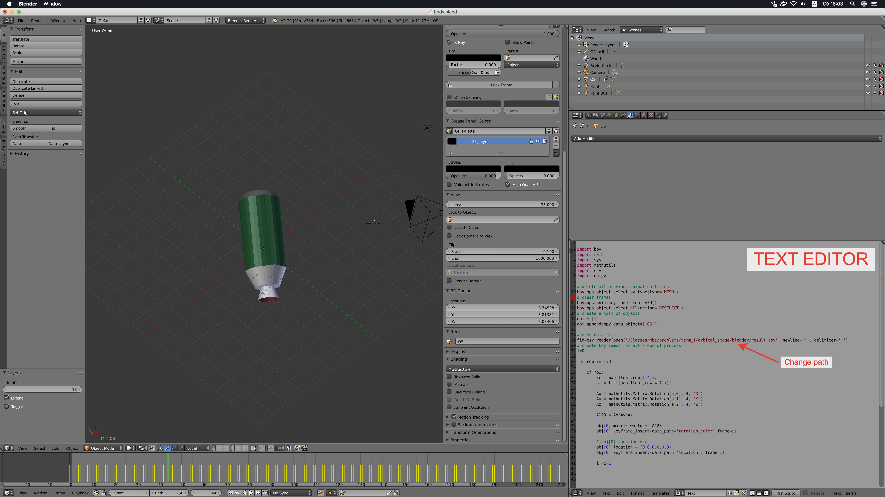

## Blender animation

Example of using Blender to animate motion of the body according to the data in result file.

### result.csv

This file contains comma separated columns that describe attitude motion of the body.

~~~
Time, x, y, z, a1, a2, a3, Vx, Vy, Vz, wx, wy, wz
~~~

where a1, a2 and a3 are the angles of XY'Z'' sequence; x, y, z is the position of the center of mass of the body.

### body.blend

The file contains model of the body and python script that imports data from the file.

1. Install Blender
1. Start Blender
1. Open body.blend file
1. Place cursor in the window with python code (Text editor)
1. Change the path to the data.csv file
1. Press Alt-p or press Right mouse button in the code editor and select "Run Script"
1. Now you can make Animation using "Render" menu

