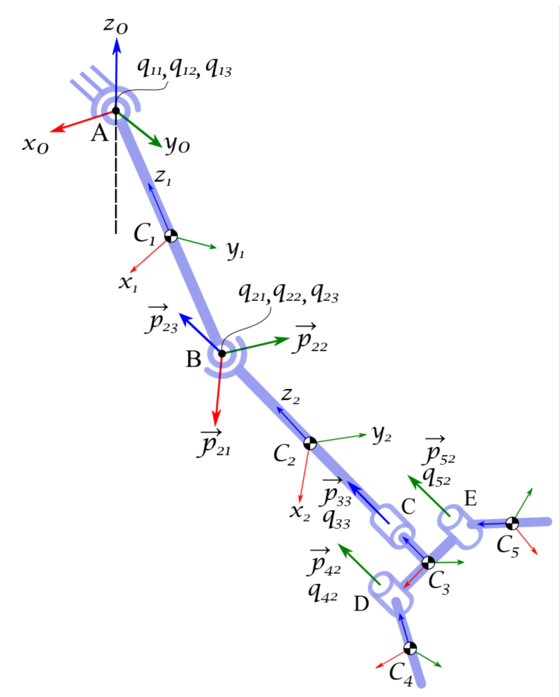

Пример (шаблон) программы для курсовой работы.  

# Files 

## model.m

Файл-скрипт model.m -- это основной модуль программы, который содержит описание модели, код для запуска процесса интегрирования уравнений движения (автор [Ishan Patel](https://github.com/patelishan2235))

## preproc.m

preproc.m script prepeares data for the simulation based on the model data

## ode_dqdt.m 

ODE "right side" function

## getForces.m 

getForces function retruns 3xn matrix (column vectors) of net forces acting on each body (in 0 frame)

## getTorques.m 

getForces function retruns 3xn matrix (column vectors) of net torques acting on each body (in body frame)

## Example 

Image by [Ishan Patel](https://github.com/patelishan2235)

