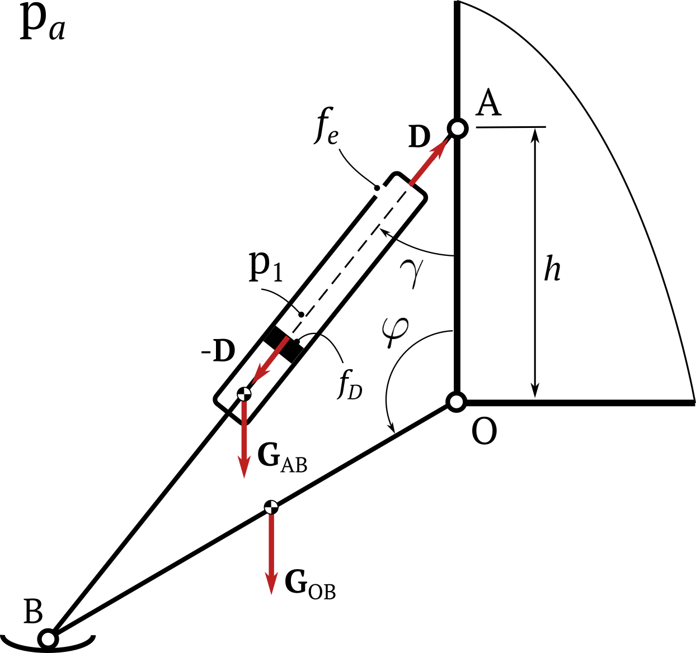

# Модель раскрытия посадочной опоры возвращаемой ступени.

TODO...

Используется упрощенная модель, схема которой показана на рисунке 1. Подкос OB представлен однородным стержнем с массой $$ m_{OB}=m $$, демпфирующий подкос $$ AB $$ представлен однородным стержнем переменной длины $$ AB = d(t) $$ и массой $$ m_{AB} $$. 

Движение посадочной опоры относительно корпуса происходит под действием усилия, создаваемого в демпфером  $$ D $$, и переносных сил инерции $$ G_{AB}=m_{AB} g n_x $$ и $$ G_{OB}=m_{OB} g n_x $$, вызванных движением корпуса с перегрузкой $$ n_x $$. 

На первом этапе раскрытия посадочной опоры после срабатывания замков её крепления в объеме рабочей полости демпфера создается избыточное давления $$ p_1>p_a $$ для быстрого отвода опоры от корпуса. На этом этапе дренажный клапан, связывающий выходную полость с атмосферой, закрыт.

После снижения давления в полости демпфера ниже атмосферного давления движение посадочной опоры замедляется. На втором этапе открывается дренажный клапан и атмосферный воздух начинает поступать в рабочую полость демпфера. Угловая скорость звеньев посадочной опоры увеличивается.

Усилие, создаваемое демпфером, зависит от разности давлений внутри полости демпфера $$ p_1 $$ и атмосферного давления $p_a$:

$$
    D=(p_1-p_a ) f_D
$$

где $$ f_D $$ -- площадь поперечного сечения демпфера. С атмосферой рабочая полость демпфера связана управляемым дренажным клапаном с площадью проходного сечения $$ f_e $$.

Уравнение раскрытия посадочной опоры имеет вид:

$$
 \ddot \varphi = \frac{\sin \varphi}{2 k l}  \left[ \frac{6 \zeta m}{\sqrt{1 + \zeta^2 - 2 \zeta \cos⁡ \varphi}} D - 3 (1+k) g n_x \right]
$$

где $$ k=AO/l $$, $$ \zeta = m / m_{AB} $$

Усилие демпфера $$ D $$ зависит от давления в выходной полости и состояния дренажного клапана. На первом этапе движения полость демпфера не связана с атмосферой, предполагается, что в рабочей полости происходит адиабатное расширение газа по закону

$$
\frac{dp_1}{dt} = - \frac{k p_1}{d} \dot d
$$

где k = 1,4 -- показатель адиабаты; d -- длина демпфера, которая зависит от угла поворота звена АВ:

$$
d=l \sqrt{1 + \zeta^2 - 2 \zeta \cos⁡ \varphi};
$$

$$ \dot d $$ -- скорость изменения длины демпфера:

$$
    \dot d = \zeta \frac{l^2 sin⁡ \varphi}{d} \dot \varphi
$$

После открытия дренажного клапана закон изменения давления в рабочей полости демпфера имеет вид:

$$
    \frac{dp_1}{dt} = k f_e \sqrt{ \frac{ 2 g k R T_a}{k-1}} \frac{p_a}{f_p d} \psi(\sigma) - \frac{k p_1 \dot d}{d}
$$

где $$ T_a $$ -- температура воздуха; R -- газовая постоянная; $$ f_p $$ -- диаметр рабочей полости демпфера; $$ $$ \sigma = \frac{p_1}{p_a} $$, $$ \psi( \sigma ) $$ -- функция расхода:

$$
\psi(\sigma) = 
\begin{cases}
0.2588, \quad 0 < \sigma \leq 0.528 \\
\sqrt{\sigma^{2/k} - \sigma^{(k+1)/k}}, \quad 0.528 < \sigma \leq 1 \\
\end{cases}
$$

 Предполагается, что начальный объем рабочей полости демпфера равен произведению начальной длины d на площадь $$ f_p $$.

